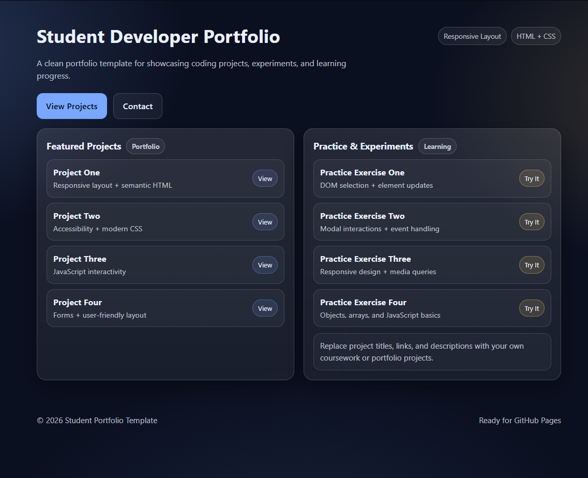

# Student Developer Portfolio Template

A clean and beginner-friendly **HTML + CSS portfolio template** designed for student developers.

Perfect for showcasing coding projects and learning progress.

---

## Features

- responsive layout
- modern dark theme
- project showcase section
- beginner-friendly HTML and CSS
- ready for GitHub Pages

---

## Preview

---

## Free Version

This repository contains the **free starter version**.

---

## Full Version

The full version includes:

- additional project sections
- more layout options
- future updates

Available here:

👉 (https://smootlabs.gumroad.com/l/ylxuk)

---

## How to Use

1. Download the files
2. Edit `index.html`
3. Replace project titles and links
4. Upload to GitHub Pages or your preferred host

---

## License

Free for personal use.
